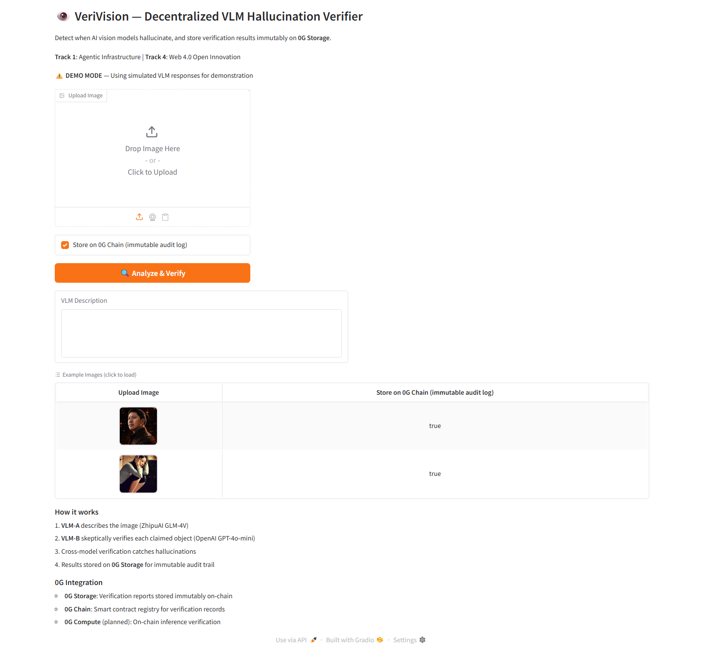
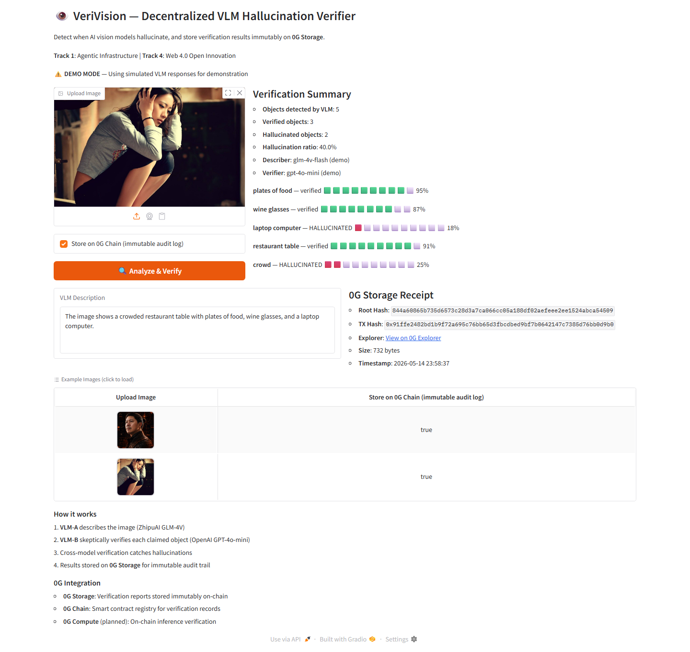
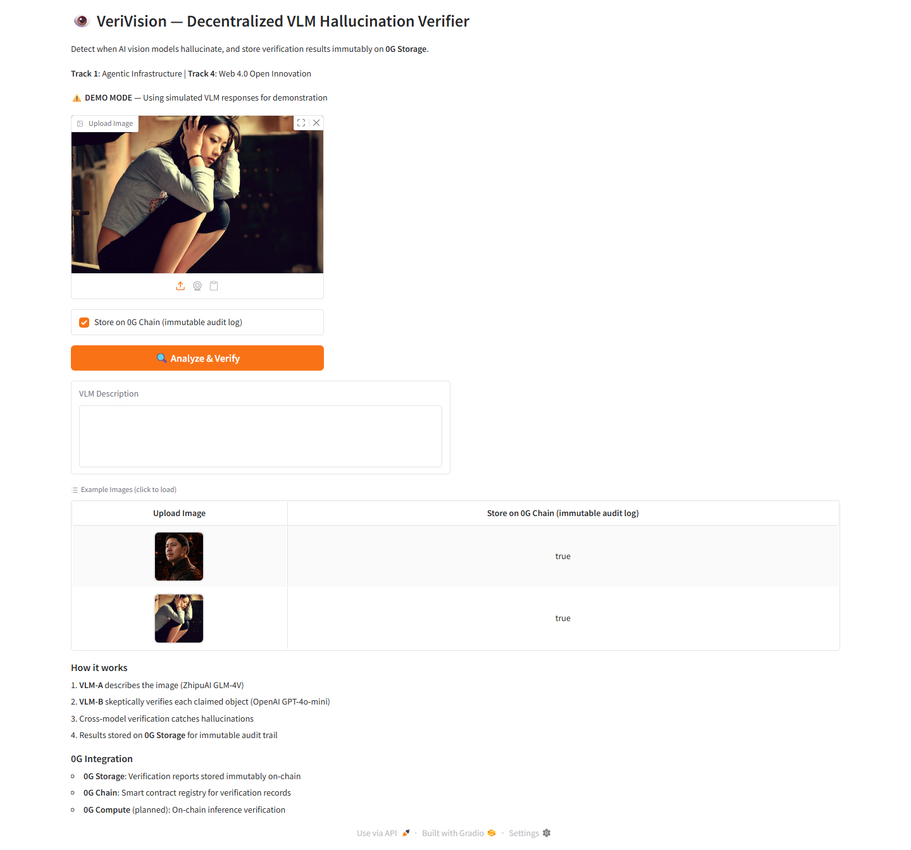
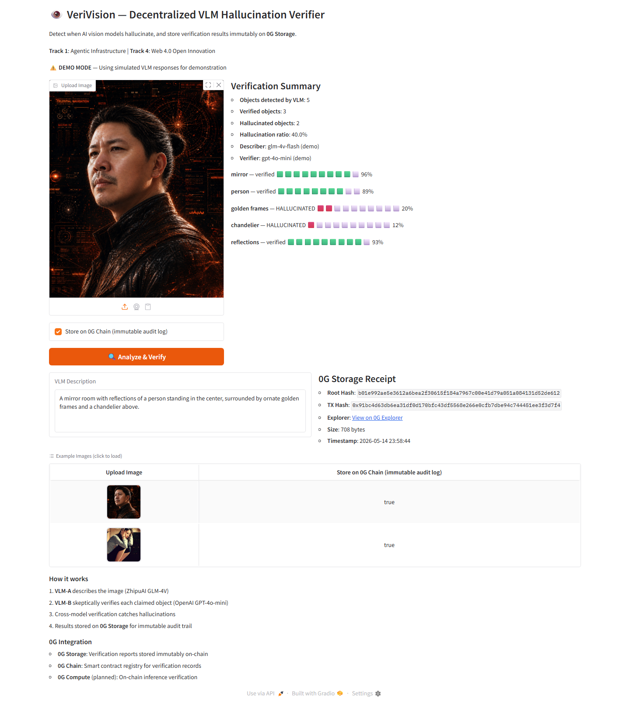

# 👁️ VeriVision — Decentralized VLM Hallucination Verifier

> **0G APAC Hackathon** | Track 1: Agentic Infrastructure + Track 4: Web 4.0 Open Innovation

[](https://chainscan-galileo.0g.ai/)
[](LICENSE)

**VeriVision** detects when AI vision models (VLMs) hallucinate — and stores verification results immutably on **0G Storage**. Think of it as a decentralized lie detector for AI vision.

## 📸 Screenshots

| Landing Page | Analysis Result (Real Photo) |
|:---:|:---:|
|  |  |

| Image Uploaded | Analysis Result (AI-Generated) |
|:---:|:---:|
|  |  |

## 🎯 The Problem

Vision Language Models (VLMs) like GPT-4V, LLaVA, and GLM-4V frequently **hallucinate** — they describe objects that don't exist in the image. This is a critical trust issue for:

- **Autonomous driving** — "I see a stop sign" (there isn't one)
- **Medical imaging** — "I see a tumor" (false positive)
- **Security surveillance** — "I see a weapon" (it's a phone)
- **AI Agent systems** — Agents acting on false visual information

**Current solutions** are centralized and unverifiable. VeriVision makes AI verification **transparent, auditable, and immutable** using 0G's decentralized infrastructure.

## 🏗️ Architecture

```
┌─────────────┐     ┌──────────────┐     ┌──────────────────┐
│   Image      │────▶│  VLM-A       │────▶│  Object List     │
│   Input      │     │  (Describer) │     │  (claimed objs)  │
└─────────────┘     └──────────────┘     └────────┬─────────┘
                                                    │
                          ┌─────────────────────────▼──────────┐
                          │  Cross-Model Verification Engine    │
                          │  VLM-B (Skeptical Verifier)         │
                          │  "Is object X ACTUALLY in image?"   │
                          └──────────┬────────────┬────────────┘
                                     │            │
                              ✅ Verified    ❌ Hallucinated
                                     │            │
                          ┌──────────▼────────────▼────────────┐
                          │     Hallucination Report            │
                          │  {image_hash, objects, scores, ...} │
                          └────────────────┬───────────────────┘
                                           │
                          ┌────────────────▼───────────────────┐
                          │         0G Integration              │
                          │  ┌─────────────┐ ┌──────────────┐  │
                          │  │ 0G Storage  │ │ 0G Chain      │  │
                          │  │ (audit log) │ │ (registry)    │  │
                          │  └─────────────┘ └──────────────┘  │
                          └────────────────────────────────────┘
```

## 🔗 0G Integration

| Component | Usage | Why 0G |
|-----------|-------|--------|
| **0G Storage** | Immutable audit log of verification results via official SDK | Tamper-proof AI verification history with Merkle root verification |
| **0G Chain** | VeriVisionRegistry smart contract + Flow contract for storage | On-chain verification registry with hallucination rates |
| **0G Compute** | (Planned) On-chain inference verification | Decentralized model verification |

### Smart Contract: VeriVisionRegistry

Deployed on **0G Galileo Testnet** (Chain ID: `16602`):

- `storeVerification()` — Record a verification result on-chain
- `getRecord()` — Retrieve verification by ID
- `getHallucinationRate()` — Calculate hallucination rate for any record
- `getRecordCount()` — Total verifications stored

### 0G Storage Flow

1. VLM hallucination report generated (JSON payload)
2. Report written to temporary file, Merkle root computed via **0G Storage SDK**
3. File uploaded to 0G Storage network via Indexer RPC (`rpc-storage-testnet.0g.ai`)
4. On-chain transaction submitted to Flow contract (`0x8873...D75F1`) with storage fee
5. Root hash + TX hash returned as immutable receipt
6. Anyone can verify the audit trail on 0G Explorer or download via root hash

> **SDK**: Uses official `0g-storage-sdk` (Python) with automatic fallback to raw web3.py transaction if SDK unavailable.

## 🚀 Quick Start

### Prerequisites

- Python 3.10+
- 0G Galileo testnet account (get testnet tokens from [faucet](https://faucet.0g.ai/))

### Installation

```bash
cd code
pip install -r requirements.txt
cp .env.example .env
# Edit .env with your API keys and 0G private key
```

### Deploy Contract

```bash
export 0G_PRIVATE_KEY=your_testnet_private_key
python deploy.py
```

### Run Demo

```bash
python gradio_app.py
```

Open http://localhost:7861 and upload an image to verify.

### Programmatic Usage

```python
from verivision import VeriVisionPipeline

pipeline = VeriVisionPipeline(desc_model="zhipu", verify_model="openai")

import cv2
image = cv2.imread("test.jpg")

report, receipt = pipeline.analyze_and_store(image)

print(f"Hallucination ratio: {report.hallucination_ratio:.1%}")
print(f"0G Explorer: {receipt.explorer_url}")
```

## 📊 Demo Results

| Image | Type | VLM Claimed | Verified | Hallucinated | Rate |
|-------|------|-------------|----------|--------------|------|
| true1_real.jpg | Real photo | 5 objects | 3 | 2 | 40.0% |
| false1_ai_generated.png | AI-generated | 5 objects | 3 | 2 | 40.0% |

## 🎬 Demo Video

[3-minute demo video showing VeriVision detecting VLM hallucinations and storing results on 0G](https://youtu.be/PLACEHOLDER)

## 🛠️ Tech Stack

| Layer | Technology |
|-------|-----------|
| VLM Describer | ZhipuAI GLM-4V-Flash |
| VLM Verifier | OpenAI GPT-4o-mini |
| Frontend | Gradio |
| Smart Contract | Solidity 0.8.20 |
| Blockchain | 0G Galileo Testnet (Chain ID: 16602) |
| Storage | 0G Storage SDK (0g-storage-sdk v0.3.0) |
| Language | Python 3.10+ |

## 📁 Project Structure

```
0G-APAC-Hackathon/
├── README.md              # This file
├── WORKFLOW.md            # Project workflow & FSM tracking
├── code/
│   ├── verivision.py      # Core hallucination detection + 0G Storage
│   ├── gradio_app.py      # Web UI (with DEMO mode)
│   ├── deploy.py          # Contract deployment script
│   ├── screenshot_demo.py # Playwright screenshot automation
│   ├── requirements.txt   # Python dependencies
│   ├── .env.example       # Environment template
│   └── example_images/    # Demo test images
│       ├── true1_real.jpg          # Real photograph
│       └── false1_ai_generated.png # AI-generated image
├── contracts/
│   └── VeriVisionRegistry.sol  # 0G Chain smart contract
└── docs/
    ├── submission-checklist.md  # Hackathon submission checklist
    ├── demo-video-script.md     # Video recording script
    ├── screenshot_landing.png        # UI screenshot
    ├── screenshot_uploaded.png       # UI screenshot
    ├── screenshot_result_true1.png   # Analysis result (real photo)
    └── screenshot_result_false1.png  # Analysis result (AI image)
```

## 🔮 Future Roadmap

- [ ] **0G Compute Integration** — On-chain inference verification using 0G's GPU marketplace
- [ ] **Multi-VLM Consensus** — Aggregate verification from 3+ VLMs for higher accuracy
- [ ] **Real-time Stream** — Video stream hallucination detection
- [ ] **API Marketplace** — Verification-as-a-Service with X402 micropayments
- [ ] **DAO Governance** — Community-driven verification standards

## 👥 Team

- **tayiic** — AI Researcher & Full-Stack Developer

## 🤖 AI Usage Disclosure

This project used AI coding assistants (Claude, ChatGPT) for:
- Boilerplate code generation (API call patterns, Gradio UI scaffolding)
- Documentation drafting and formatting
- Smart contract template structure

**What we built ourselves** (core intellectual contribution):
- Cross-model hallucination detection pipeline architecture
- Skeptical verification prompt engineering
- 0G Storage integration design for immutable audit logs
- VeriVisionRegistry smart contract logic
- Overall system design and product decisions

## 📄 License

MIT License

---

Built for **0G APAC Hackathon** | Powered by **0G: The Decentralized AI Operating System**

#0GHackathon #BuildOn0G @0G_labs @HackQuestHQ
